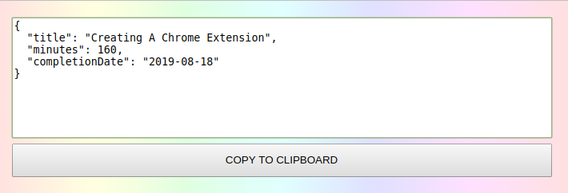

# OmniCourse-Agent

_Browser extension for OmniCourse descriptors_

## Introduction

**OmniCourse-Agent** is a browser extension that can generate an [OmniCourse](https://github.com/giancosta86/OmniCourse) descriptor while you are visiting a course webpage.

## Usage

1. Browse to the page of a course published by a supported provider

1. The OmniCourse button in the toolbar becomes active

1. Click on the OmniCourse button

1. OmniCourse-Agent will try to gather enough information - consequently generating a course descriptor. In particular, the _title_ and the _duration_ are mandatory

1. Copy the generated descriptor to the clipboard

**Please, note**: when missing, some fields could be initialized to a sensible default value - for example, **completionDate** defaults to _the current date_.

## Supported providers

OmniCourse-Agent now supports the following course portals:

- [Pluralsight](https://www.pluralsight.com/)

- [Udemy](https://www.udemy.com/)

- [Packt](https://www.packtpub.com/)

- [LinkedIn](https://www.linkedin.com/learning/)

## Privacy policy

OmniCourse-Agent is designed to parse course pages to create OmniCourse descriptors: consequently, it does not store and does not upload any personal information.

## Referenced components

### npm libraries

- [archiver](https://www.npmjs.com/package/archiver)
- [cpr](https://www.npmjs.com/package/cpr)
- [mkdirp](https://www.npmjs.com/package/mkdirp)
- [rimraf](https://www.npmjs.com/package/rimraf)
- [svg2img](https://www.npmjs.com/package/svg2img)
- [watch](https://www.npmjs.com/package/watch)

### Images

- [Rainbow loader](https://icons8.com/preloaders/en/circular/rainbow/) from [Preloaders.net](https://icons8.com/preloaders/)

## Further references

- [OmniCourse](https://github.com/giancosta86/OmniCourse) - React component for drill-down chart analysis of online courses
